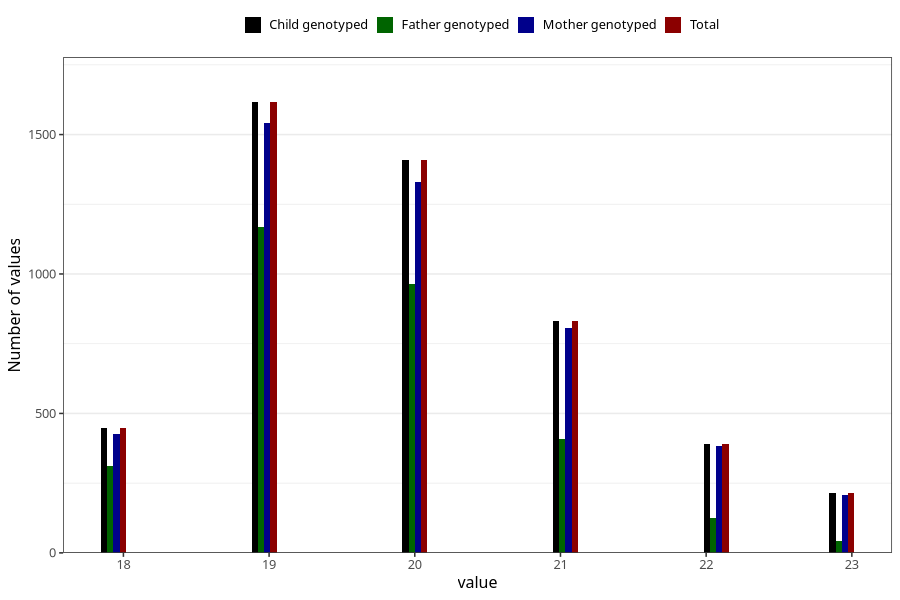

# age_answering_q_19
Variable mapping to `AGE_YRS_VG` in `19_aarsskjema_standard`.
- Number of values:

| Value | Total | Child genotyped | Mother genotyped | Father genotyped |
| ----- | ----- | --------------- | ---------------- | ---------------- |
| Missing | 76091 | 76091 | 71917 | 50583 |
| Non-missing | 4914 | 4914 | 4700 | 3021 |
| 18 | 448 | 448 | 428 | 313 |
| 19 | 1616 | 1616 | 1541 | 1170 |
| 20 | 1410 | 1410 | 1331 | 963 |
| 21 | 833 | 833 | 808 | 410 |
| 22 | 392 | 392 | 384 | 124 |
| 23 | 215 | 215 | 208 | 41 |

