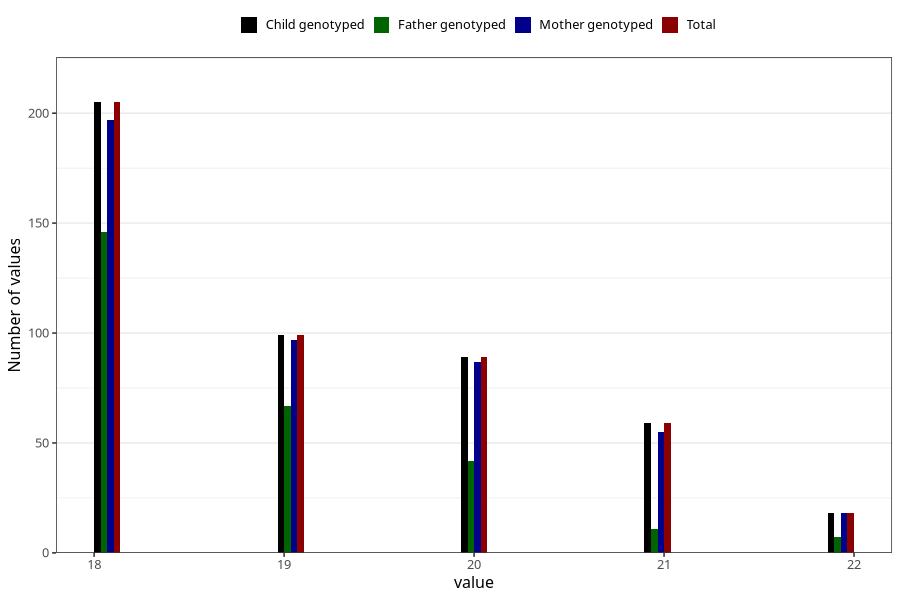

# age_answering_q_wf
Variable mapping to `AGE_YRS_WK` in `WF_Klinikkskjema_v12`.
- Number of values:

| Value | Total | Child genotyped | Mother genotyped | Father genotyped |
| ----- | ----- | --------------- | ---------------- | ---------------- |
| Missing | 80535 | 80535 | 76163 | 53331 |
| Non-missing | 470 | 470 | 454 | 273 |
| 18 | 205 | 205 | 197 | 146 |
| 19 | 99 | 99 | 97 | 67 |
| 20 | 89 | 89 | 87 | 42 |
| 21 | 59 | 59 | 55 | 11 |
| 22 | 18 | 18 | 18 | 7 |

