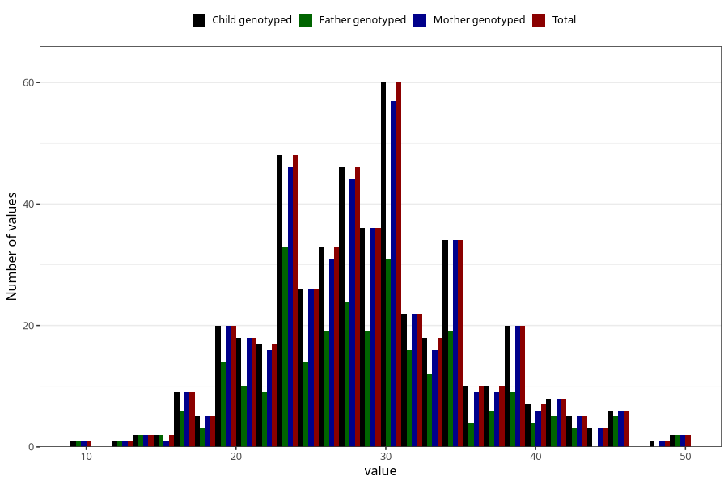

# body_fat_pct_wf
Variable mapping to `WK16` in `WF_Klinikkskjema_v12`.
- Number of values:

| Value | Total | Child genotyped | Mother genotyped | Father genotyped |
| ----- | ----- | --------------- | ---------------- | ---------------- |
| Missing | 80535 | 80535 | 76163 | 53331 |
| Non-missing | 470 | 470 | 454 | 273 |
| 25th percentile | 24 | 24 | 24 | 24 |
| 50th percentile | 29 | 29 | 29 | 28 |
| 75th percentile | 33 | 33 | 33 | 33 |
| Mean | 28.9021276595745 | 28.9021276595745 | 28.9052863436123 | 28.5128205128205 |
| Standard deviation | 6.64986298852723 | 6.64986298852723 | 6.66759275788005 | 6.90220689563606 |
| N | 470 | 470 | 454 | 273 |

