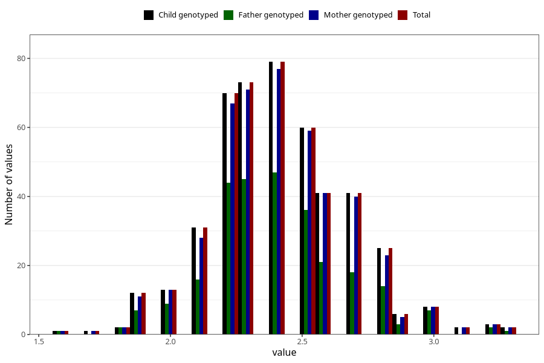

# bone_mass_kg_wf
Variable mapping to `WK21` in `WF_Klinikkskjema_v12`.
- Number of values:

| Value | Total | Child genotyped | Mother genotyped | Father genotyped |
| ----- | ----- | --------------- | ---------------- | ---------------- |
| Missing | 80535 | 80535 | 76163 | 53331 |
| Non-missing | 470 | 470 | 454 | 273 |
| 1.6 | 1 | 1 | 1 | 1 |
| 1.7 | 1 | 1 | 1 | 0 |
| 1.8 | 2 | 2 | 2 | 2 |
| 1.9 | 12 | 12 | 11 | 7 |
| 2 | 13 | 13 | 13 | 9 |
| 2.1 | 31 | 31 | 28 | 16 |
| 2.2 | 70 | 70 | 67 | 44 |
| 2.3 | 73 | 73 | 71 | 45 |
| 2.4 | 79 | 79 | 77 | 47 |
| 2.5 | 60 | 60 | 59 | 36 |
| 2.6 | 41 | 41 | 41 | 21 |
| 2.7 | 41 | 41 | 40 | 18 |
| 2.8 | 25 | 25 | 23 | 14 |
| 2.9 | 6 | 6 | 5 | 3 |
| 3 | 8 | 8 | 8 | 7 |
| 3.1 | 2 | 2 | 2 | 0 |
| 3.2 | 3 | 3 | 3 | 2 |
| 3.3 | 2 | 2 | 2 | 1 |

