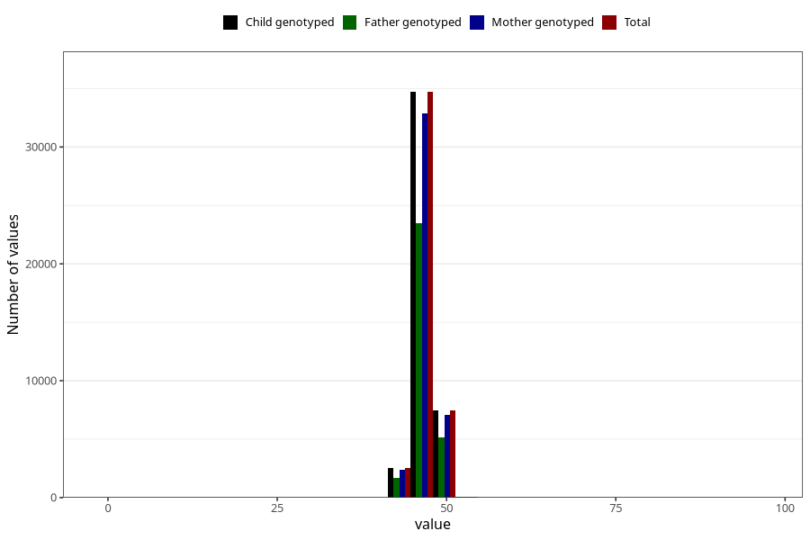

# hc_1y
Variable mapping to `EE394` in `Skjema5_18mnd_v12`.
- Number of values:

| Value | Total | Child genotyped | Mother genotyped | Father genotyped |
| ----- | ----- | --------------- | ---------------- | ---------------- |
| Missing | 36131 | 36131 | 34107 | 23250 |
| Non-missing | 44874 | 44874 | 42510 | 30354 |
| 25th percentile | 46 | 46 | 46 | 46 |
| 50th percentile | 47 | 47 | 47 | 47 |
| 75th percentile | 47.8 | 47.8 | 47.8 | 47.8 |
| Mean | 46.8493582029683 | 46.8493582029683 | 46.8499270759821 | 46.8563385385781 |
| Standard deviation | 1.58298697391787 | 1.58298697391787 | 1.58551094135709 | 1.57058867041197 |
| N | 44874 | 44874 | 42510 | 30354 |

