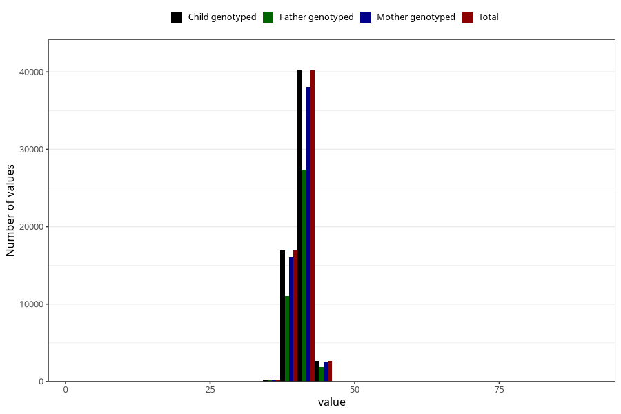

# hc_3m
Variable mapping to `DD220` in `Skjema4_6mnd_v12`.
- Number of values:

| Value | Total | Child genotyped | Mother genotyped | Father genotyped |
| ----- | ----- | --------------- | ---------------- | ---------------- |
| Missing | 20898 | 20898 | 19667 | 13144 |
| Non-missing | 60107 | 60107 | 56950 | 40460 |
| 25th percentile | 40 | 40 | 40 | 40 |
| 50th percentile | 41 | 41 | 41 | 41 |
| 75th percentile | 42 | 42 | 42 | 42 |
| Mean | 40.9704244098025 | 40.9704244098025 | 40.9705021949078 | 40.9807439446367 |
| Standard deviation | 1.38566113855127 | 1.38566113855127 | 1.38749552850962 | 1.38704256815402 |
| N | 60107 | 60107 | 56950 | 40460 |

