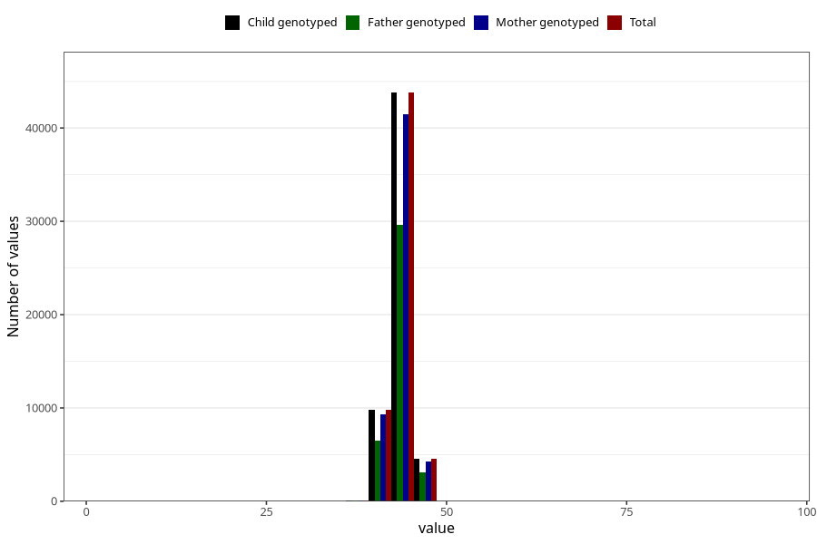

# hc_6m
Variable mapping to `DD226` in `Skjema4_6mnd_v12`.
- Number of values:

| Value | Total | Child genotyped | Mother genotyped | Father genotyped |
| ----- | ----- | --------------- | ---------------- | ---------------- |
| Missing | 22710 | 22710 | 21411 | 14341 |
| Non-missing | 58295 | 58295 | 55206 | 39263 |
| 25th percentile | 42.8 | 42.8 | 42.8 | 42.8 |
| 50th percentile | 43.6 | 43.6 | 43.6 | 43.6 |
| 75th percentile | 44.5 | 44.5 | 44.5 | 44.5 |
| Mean | 43.666106870229 | 43.666106870229 | 43.6658388580951 | 43.6718870183124 |
| Standard deviation | 1.50940859364625 | 1.50940859364625 | 1.50997123878917 | 1.50804634612108 |
| N | 58295 | 58295 | 55206 | 39263 |

