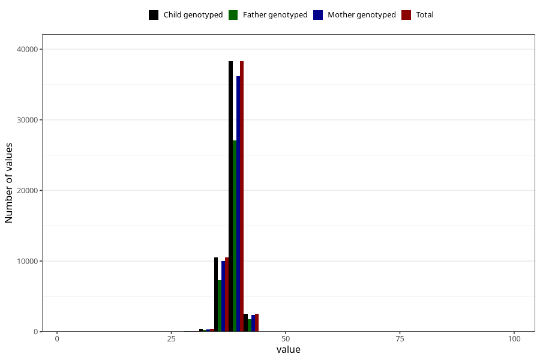

# hc_6w
Variable mapping to `DD214` in `Skjema4_6mnd_v12`.
- Number of values:

| Value | Total | Child genotyped | Mother genotyped | Father genotyped |
| ----- | ----- | --------------- | ---------------- | ---------------- |
| Missing | 29194 | 29194 | 27650 | 17188 |
| Non-missing | 51811 | 51811 | 48967 | 36416 |
| 25th percentile | 37.9 | 37.9 | 37.9 | 38 |
| 50th percentile | 38.7 | 38.7 | 38.7 | 38.7 |
| 75th percentile | 39.5 | 39.5 | 39.5 | 39.5 |
| Mean | 38.6337901217888 | 38.6337901217888 | 38.6323401474462 | 38.6409517794376 |
| Standard deviation | 1.49575577660594 | 1.49575577660594 | 1.49691091019369 | 1.51751781591096 |
| N | 51811 | 51811 | 48967 | 36416 |

