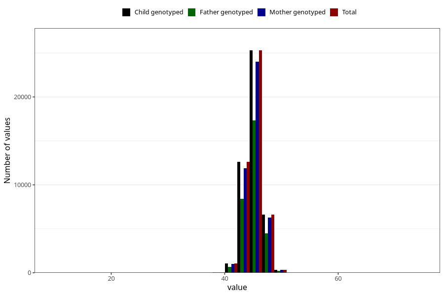

# hc_8m
Variable mapping to `EE388` in `Skjema5_18mnd_v12`.
- Number of values:

| Value | Total | Child genotyped | Mother genotyped | Father genotyped |
| ----- | ----- | --------------- | ---------------- | ---------------- |
| Missing | 34960 | 34960 | 32969 | 22452 |
| Non-missing | 46045 | 46045 | 43648 | 31152 |
| 25th percentile | 44 | 44 | 44 | 44 |
| 50th percentile | 45 | 45 | 45 | 45 |
| 75th percentile | 46 | 46 | 46 | 46 |
| Mean | 45.1154631338908 | 45.1154631338908 | 45.1182917888563 | 45.1277157164869 |
| Standard deviation | 1.51347859524734 | 1.51347859524734 | 1.51596506022572 | 1.50678912854797 |
| N | 46045 | 46045 | 43648 | 31152 |

