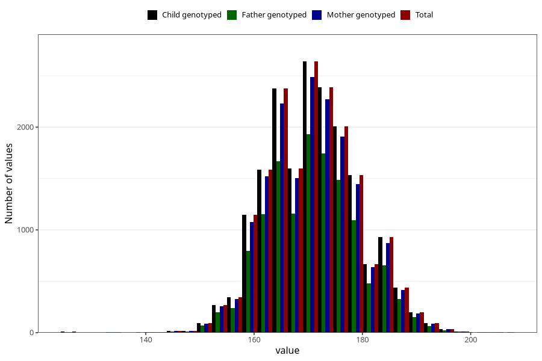

# height_14c
Variable mapping to `UB220` in `Ungdomsskjema_Barn_v12_standard`.
- Number of values:

| Value | Total | Child genotyped | Mother genotyped | Father genotyped |
| ----- | ----- | --------------- | ---------------- | ---------------- |
| Missing | 62581 | 62581 | 59205 | 40305 |
| Non-missing | 18424 | 18424 | 17412 | 13299 |
| 25th percentile | 165 | 165 | 165 | 165 |
| 50th percentile | 170 | 170 | 170 | 170 |
| 75th percentile | 176 | 176 | 176 | 176 |
| Mean | 170.807587928789 | 170.807587928789 | 170.814208591776 | 170.882697947214 |
| Standard deviation | 8.36051550885288 | 8.36051550885288 | 8.35571236764955 | 8.33568276861316 |
| N | 18424 | 18424 | 17412 | 13299 |

