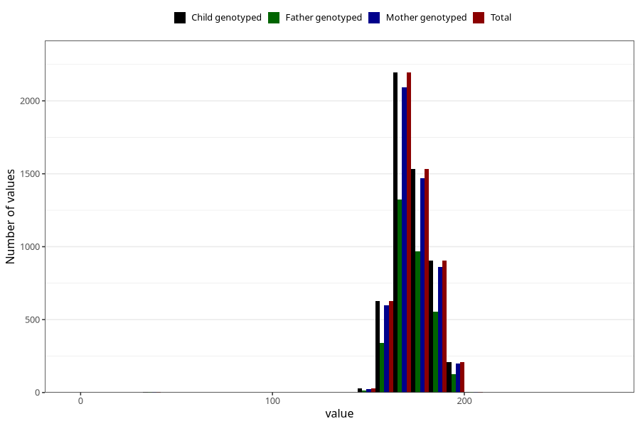

# height_18
Variable mapping to `VE43` in `18-aarsskjema_v12_standard`.
- Number of values:

| Value | Total | Child genotyped | Mother genotyped | Father genotyped |
| ----- | ----- | --------------- | ---------------- | ---------------- |
| Missing | 75495 | 75495 | 71353 | 50267 |
| Non-missing | 5510 | 5510 | 5264 | 3337 |
| 25th percentile | 166 | 166 | 166 | 167 |
| 50th percentile | 172 | 172 | 172 | 172 |
| 75th percentile | 180 | 180 | 180 | 180 |
| Mean | 172.831034482759 | 172.831034482759 | 172.844604863222 | 173.230746179203 |
| Standard deviation | 10.8351037067858 | 10.8351037067858 | 10.8958492130602 | 10.4351417760132 |
| N | 5510 | 5510 | 5264 | 3337 |

