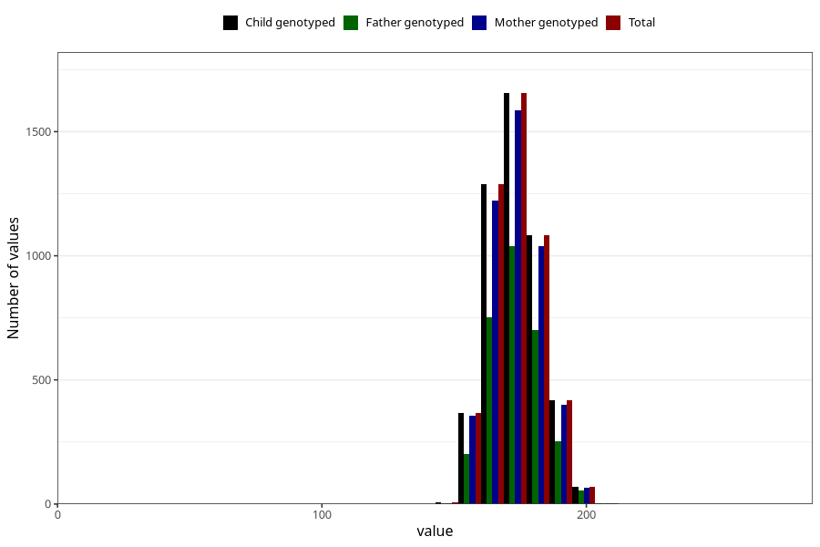

# height_19
Variable mapping to `VG134` in `19_aarsskjema_standard`.
- Number of values:

| Value | Total | Child genotyped | Mother genotyped | Father genotyped |
| ----- | ----- | --------------- | ---------------- | ---------------- |
| Missing | 76112 | 76112 | 71937 | 50596 |
| Non-missing | 4893 | 4893 | 4680 | 3008 |
| 25th percentile | 166 | 166 | 166 | 167 |
| 50th percentile | 172 | 172 | 172 | 173 |
| 75th percentile | 180 | 180 | 180 | 180 |
| Mean | 173.26977314531 | 173.26977314531 | 173.252564102564 | 173.545877659574 |
| Standard deviation | 9.9127211174639 | 9.9127211174639 | 9.92620203831687 | 10.0080723800611 |
| N | 4893 | 4893 | 4680 | 3008 |

