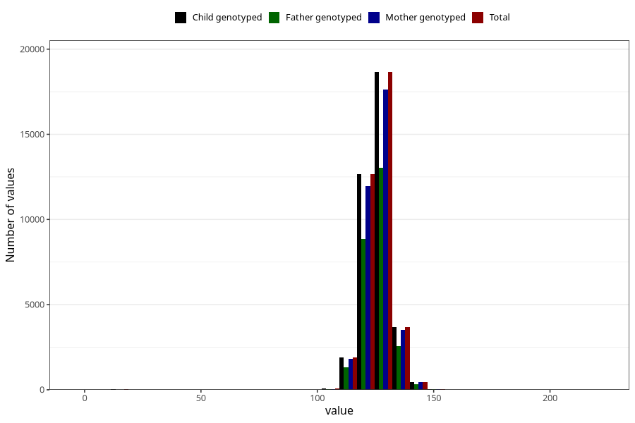

# height_7y_cm
Variable mapping to `JJ408` in `Skjema7aar_v12`.
- Number of values:

| Value | Total | Child genotyped | Mother genotyped | Father genotyped |
| ----- | ----- | --------------- | ---------------- | ---------------- |
| Missing | 43501 | 43501 | 41128 | 27414 |
| Non-missing | 37504 | 37504 | 35489 | 26190 |
| 25th percentile | 122 | 122 | 122 | 122 |
| 50th percentile | 126 | 126 | 126 | 126 |
| 75th percentile | 130 | 130 | 130 | 130 |
| Mean | 125.897770904437 | 125.897770904437 | 125.915297697878 | 125.878006872852 |
| Standard deviation | 6.67806012588781 | 6.67806012588781 | 6.55530974958313 | 6.57417062621675 |
| N | 37504 | 37504 | 35489 | 26190 |

