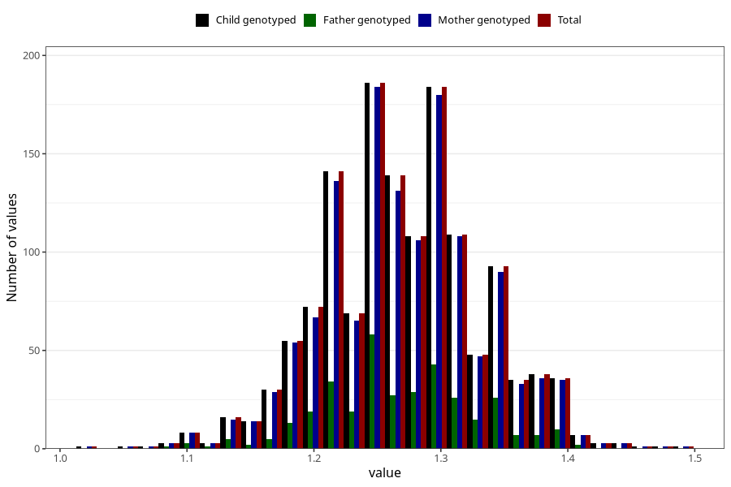

# height_7y_m
Variable mapping to `JJ324` in `Skjema7aar_v12`.
- Number of values:

| Value | Total | Child genotyped | Mother genotyped | Father genotyped |
| ----- | ----- | --------------- | ---------------- | ---------------- |
| Missing | 79599 | 79599 | 75254 | 53252 |
| Non-missing | 1406 | 1406 | 1363 | 352 |
| 25th percentile | 1.23 | 1.23 | 1.23 | 1.23 |
| 50th percentile | 1.27 | 1.27 | 1.27 | 1.26 |
| 75th percentile | 1.31 | 1.31 | 1.31 | 1.31 |
| Mean | 1.26988620199147 | 1.26988620199147 | 1.27005135730007 | 1.26866477272727 |
| Standard deviation | 0.0628548675263662 | 0.0628548675263662 | 0.0628735322765607 | 0.0606534324623419 |
| N | 1406 | 1406 | 1363 | 352 |

