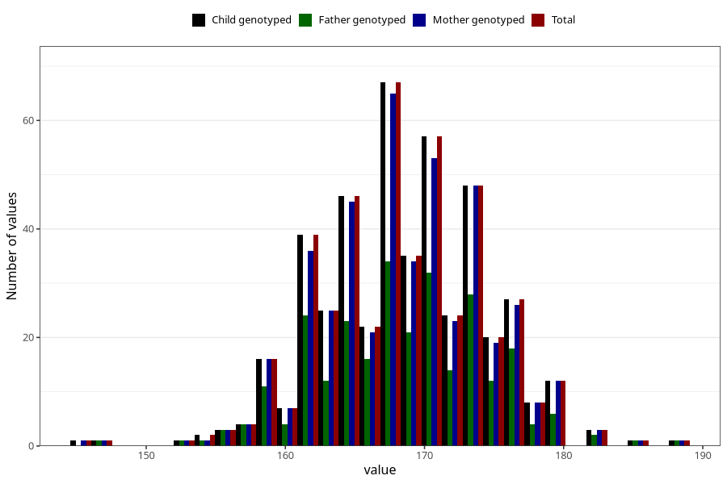

# height_wf
Variable mapping to `WK12` in `WF_Klinikkskjema_v12`.
- Number of values:

| Value | Total | Child genotyped | Mother genotyped | Father genotyped |
| ----- | ----- | --------------- | ---------------- | ---------------- |
| Missing | 80535 | 80535 | 76163 | 53331 |
| Non-missing | 470 | 470 | 454 | 273 |
| 25th percentile | 164 | 164 | 164 | 164 |
| 50th percentile | 169 | 169 | 169 | 169 |
| 75th percentile | 173 | 173 | 173 | 173 |
| Mean | 168.46170212766 | 168.46170212766 | 168.5 | 168.421245421245 |
| Standard deviation | 5.89510487514073 | 5.89510487514073 | 5.90197706987526 | 6.17411483789043 |
| N | 470 | 470 | 454 | 273 |

