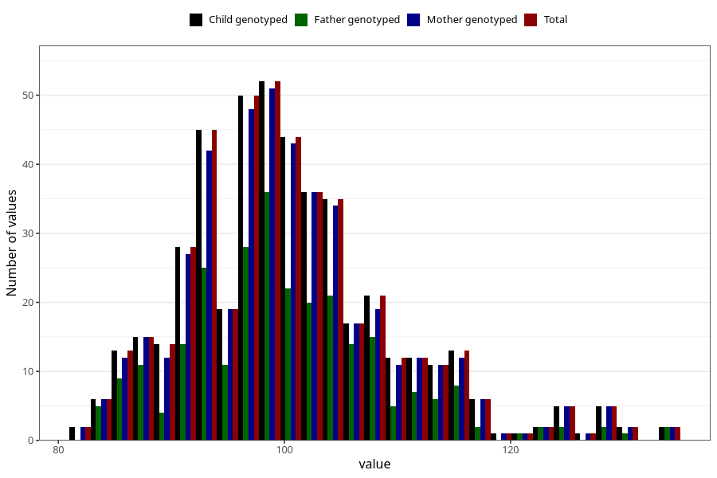

# hip_cm_wf
Variable mapping to `WK14` in `WF_Klinikkskjema_v12`.
- Number of values:

| Value | Total | Child genotyped | Mother genotyped | Father genotyped |
| ----- | ----- | --------------- | ---------------- | ---------------- |
| Missing | 80535 | 80535 | 76163 | 53331 |
| Non-missing | 470 | 470 | 454 | 273 |
| 25th percentile | 94 | 94 | 94 | 95 |
| 50th percentile | 99 | 99 | 99 | 99 |
| 75th percentile | 105 | 105 | 105 | 105 |
| Mean | 100.497872340426 | 100.497872340426 | 100.568281938326 | 100.494505494505 |
| Standard deviation | 9.291936329488 | 9.291936329488 | 9.32008480144936 | 9.17802718097481 |
| N | 470 | 470 | 454 | 273 |

