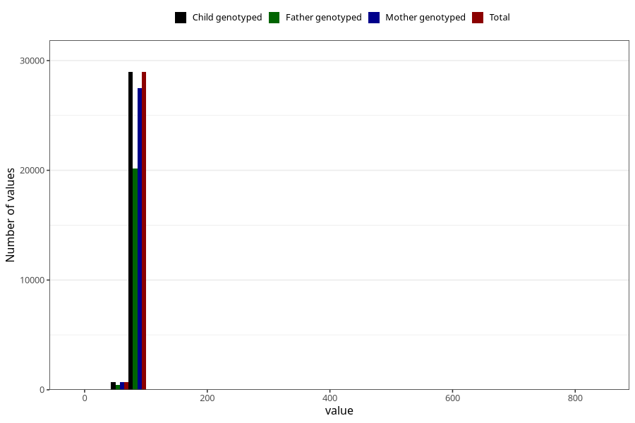

# length_15_18m_2
Variable mapping to `GG15` in `Skjema6_3aar_v12`.
- Number of values:

| Value | Total | Child genotyped | Mother genotyped | Father genotyped |
| ----- | ----- | --------------- | ---------------- | ---------------- |
| Missing | 51331 | 51331 | 48469 | 32941 |
| Non-missing | 29674 | 29674 | 28148 | 20663 |
| 25th percentile | 78.5 | 78.5 | 78.5 | 78.25 |
| 50th percentile | 80.5 | 80.5 | 80.5 | 80.5 |
| 75th percentile | 83 | 83 | 83 | 83 |
| Mean | 80.5379658960706 | 80.5379658960706 | 80.5123987494671 | 80.5229831099066 |
| Standard deviation | 8.39436060186322 | 8.39436060186322 | 7.31187798226573 | 8.47445881447847 |
| N | 29674 | 29674 | 28148 | 20663 |

