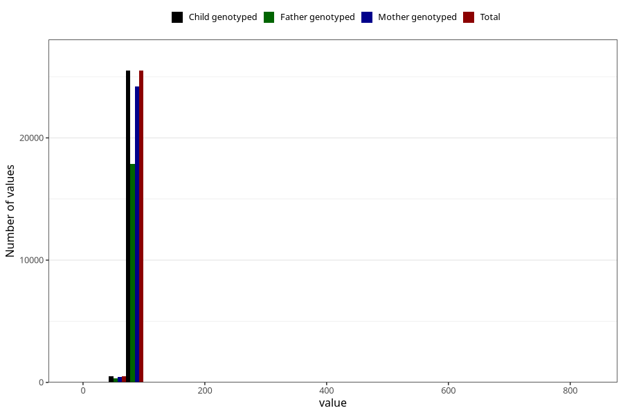

# length_16m
Variable created during phenotype curation.
- Number of values:

| Value | Total | Child genotyped | Mother genotyped | Father genotyped |
| ----- | ----- | --------------- | ---------------- | ---------------- |
| Missing | 55004 | 55004 | 51939 | 35423 |
| Non-missing | 26001 | 26001 | 24678 | 18181 |
| 25th percentile | 78.5 | 78.5 | 78.5 | 78.5 |
| 50th percentile | 80.5 | 80.5 | 80.5 | 80.5 |
| 75th percentile | 83 | 83 | 83 | 83 |
| Mean | 80.5550055767086 | 80.5550055767086 | 80.5264486587244 | 80.5240910840988 |
| Standard deviation | 7.42890526934692 | 7.42890526934692 | 5.8805094796025 | 6.85199884957722 |
| N | 26001 | 26001 | 24678 | 18181 |

