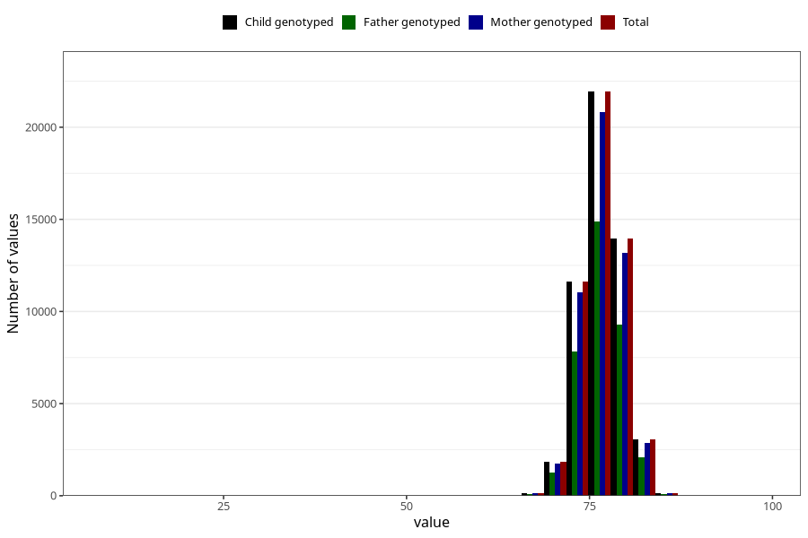

# length_1y
Variable mapping to `EE393` in `Skjema5_18mnd_v12`.
- Number of values:

| Value | Total | Child genotyped | Mother genotyped | Father genotyped |
| ----- | ----- | --------------- | ---------------- | ---------------- |
| Missing | 28302 | 28302 | 26656 | 18092 |
| Non-missing | 52703 | 52703 | 49961 | 35512 |
| 25th percentile | 74.5 | 74.5 | 74.5 | 74.5 |
| 50th percentile | 76.5 | 76.5 | 76.5 | 76.5 |
| 75th percentile | 78 | 78 | 78 | 78 |
| Mean | 76.440861051553 | 76.440861051553 | 76.441254178259 | 76.4434979725163 |
| Standard deviation | 2.79976225064145 | 2.79976225064145 | 2.7835084256363 | 2.80533972455639 |
| N | 52703 | 52703 | 49961 | 35512 |

