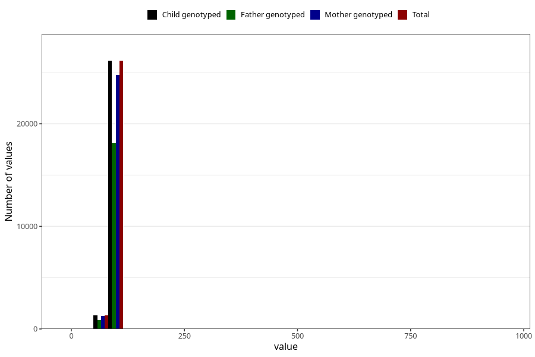

# length_2y
Variable mapping to `GG20` in `Skjema6_3aar_v12`.
- Number of values:

| Value | Total | Child genotyped | Mother genotyped | Father genotyped |
| ----- | ----- | --------------- | ---------------- | ---------------- |
| Missing | 53535 | 53535 | 50572 | 34536 |
| Non-missing | 27470 | 27470 | 26045 | 19068 |
| 25th percentile | 86 | 86 | 86 | 86 |
| 50th percentile | 88.5 | 88.5 | 88.5 | 88.5 |
| 75th percentile | 91 | 91 | 91 | 91 |
| Mean | 88.4820749908992 | 88.4820749908992 | 88.4759800345556 | 88.5016519823789 |
| Standard deviation | 9.22884168997608 | 9.22884168997608 | 9.43502188867842 | 9.40568878866758 |
| N | 27470 | 27470 | 26045 | 19068 |

