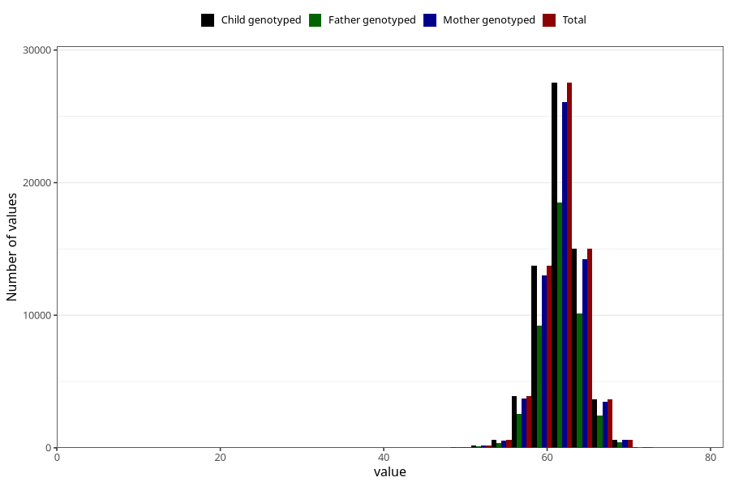

# length_3m
Variable mapping to `DD219` in `Skjema4_6mnd_v12`.
- Number of values:

| Value | Total | Child genotyped | Mother genotyped | Father genotyped |
| ----- | ----- | --------------- | ---------------- | ---------------- |
| Missing | 15638 | 15638 | 14661 | 9749 |
| Non-missing | 65367 | 65367 | 61956 | 43855 |
| 25th percentile | 60.5 | 60.5 | 60.5 | 60.5 |
| 50th percentile | 62 | 62 | 62 | 62 |
| 75th percentile | 63.8 | 63.8 | 63.7 | 63.5 |
| Mean | 61.9816222252819 | 61.9816222252819 | 61.9803344308864 | 61.9866127009463 |
| Standard deviation | 2.5870571469581 | 2.5870571469581 | 2.58574551883092 | 2.56363126819387 |
| N | 65367 | 65367 | 61956 | 43855 |

