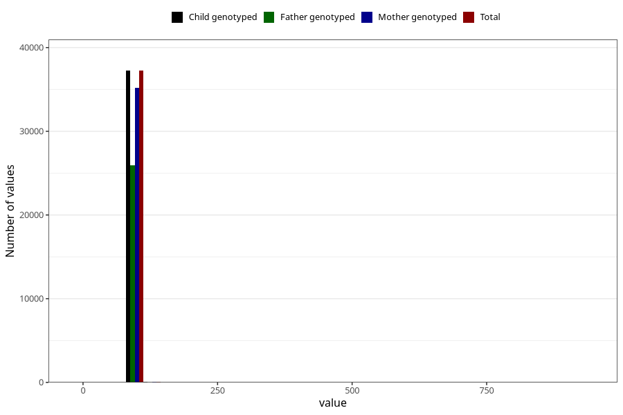

# length_3y
Variable mapping to `GG25` in `Skjema6_3aar_v12`.
- Number of values:

| Value | Total | Child genotyped | Mother genotyped | Father genotyped |
| ----- | ----- | --------------- | ---------------- | ---------------- |
| Missing | 43664 | 43664 | 41296 | 27584 |
| Non-missing | 37341 | 37341 | 35321 | 26020 |
| 25th percentile | 94 | 94 | 94 | 94 |
| 50th percentile | 97 | 97 | 97 | 97 |
| 75th percentile | 99 | 99 | 99 | 99 |
| Mean | 96.6593288878177 | 96.6593288878177 | 96.6566943178279 | 96.6647040737894 |
| Standard deviation | 6.35938771206475 | 6.35938771206475 | 6.4409632755515 | 6.90719921420525 |
| N | 37341 | 37341 | 35321 | 26020 |

