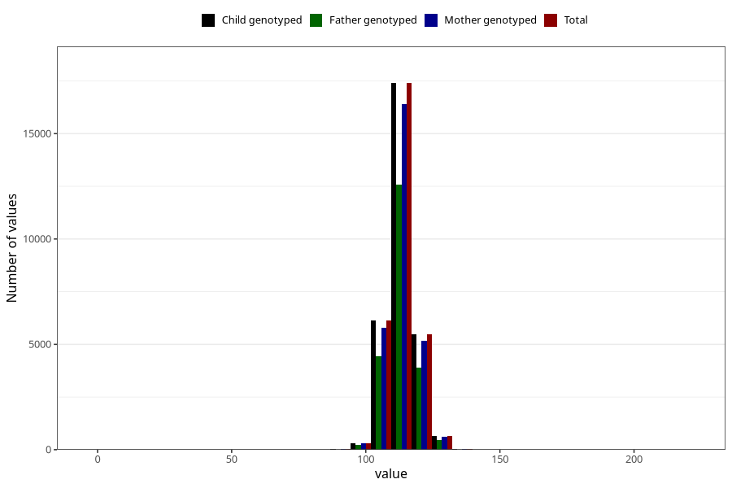

# length_5y
Variable mapping to `LL12` in `Skjema5aar_v12`.
- Number of values:

| Value | Total | Child genotyped | Mother genotyped | Father genotyped |
| ----- | ----- | --------------- | ---------------- | ---------------- |
| Missing | 50950 | 50950 | 48227 | 31958 |
| Non-missing | 30055 | 30055 | 28390 | 21646 |
| 25th percentile | 110 | 110 | 110 | 110 |
| 50th percentile | 113 | 113 | 113 | 113 |
| 75th percentile | 117 | 117 | 117 | 116 |
| Mean | 113.202129429379 | 113.202129429379 | 113.207220852413 | 113.183082324679 |
| Standard deviation | 6.22309625416784 | 6.22309625416784 | 6.28223532426623 | 6.27185555346241 |
| N | 30055 | 30055 | 28390 | 21646 |

