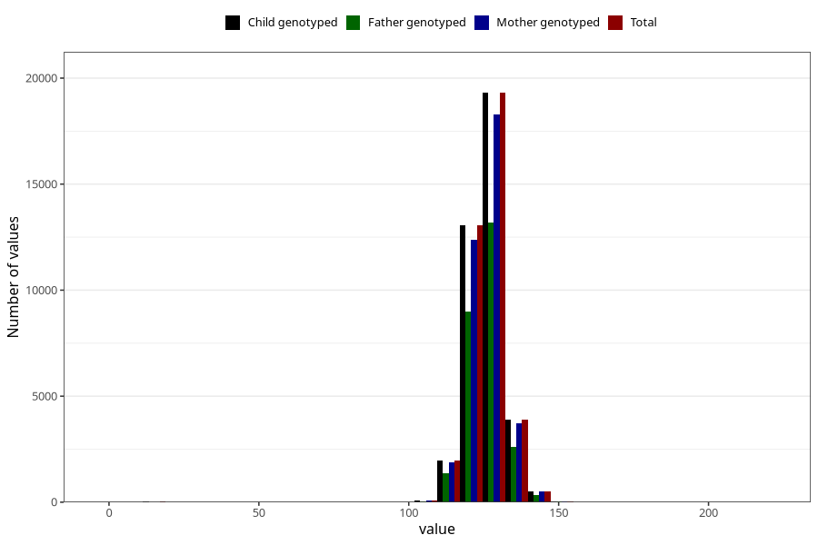

# length_7y
Variable created during phenotype curation.
- Number of values:

| Value | Total | Child genotyped | Mother genotyped | Father genotyped |
| ----- | ----- | --------------- | ---------------- | ---------------- |
| Missing | 42095 | 42095 | 39765 | 27062 |
| Non-missing | 38910 | 38910 | 36852 | 26542 |
| 25th percentile | 122 | 122 | 122 | 122 |
| 50th percentile | 126 | 126 | 126 | 126 |
| 75th percentile | 130 | 130 | 130 | 130 |
| Mean | 125.937188383449 | 125.937188383449 | 125.955606208618 | 125.891115967146 |
| Standard deviation | 6.66730967361819 | 6.66730967361819 | 6.54874320800057 | 6.56854811890567 |
| N | 38910 | 38910 | 36852 | 26542 |

