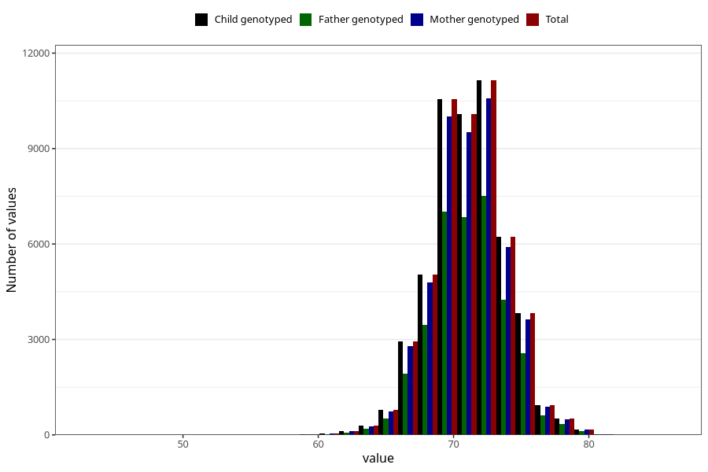

# length_8m
Variable mapping to `EE387` in `Skjema5_18mnd_v12`.
- Number of values:

| Value | Total | Child genotyped | Mother genotyped | Father genotyped |
| ----- | ----- | --------------- | ---------------- | ---------------- |
| Missing | 28254 | 28254 | 26601 | 18080 |
| Non-missing | 52751 | 52751 | 50016 | 35524 |
| 25th percentile | 69.5 | 69.5 | 69.5 | 69.5 |
| 50th percentile | 71 | 71 | 71 | 71 |
| 75th percentile | 73 | 73 | 73 | 73 |
| Mean | 71.2023715190233 | 71.2023715190233 | 71.2006517914268 | 71.2130475171715 |
| Standard deviation | 2.81467479226596 | 2.81467479226596 | 2.81283329859455 | 2.7883600035877 |
| N | 52751 | 52751 | 50016 | 35524 |

