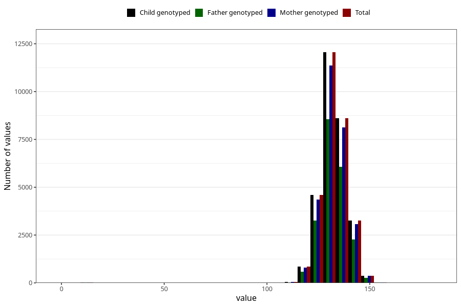

# length_8y
Variable mapping to `NN24` in `Skjema8aar_v12`.
- Number of values:

| Value | Total | Child genotyped | Mother genotyped | Father genotyped |
| ----- | ----- | --------------- | ---------------- | ---------------- |
| Missing | 51148 | 51148 | 48425 | 32555 |
| Non-missing | 29857 | 29857 | 28192 | 21049 |
| 25th percentile | 128 | 128 | 128 | 128 |
| 50th percentile | 132 | 132 | 132 | 132 |
| 75th percentile | 136 | 136 | 136 | 136 |
| Mean | 132.098703821549 | 132.098703821549 | 132.093430760499 | 132.106560881752 |
| Standard deviation | 6.60091534015577 | 6.60091534015577 | 6.64216855825073 | 6.43553383786669 |
| N | 29857 | 29857 | 28192 | 21049 |

