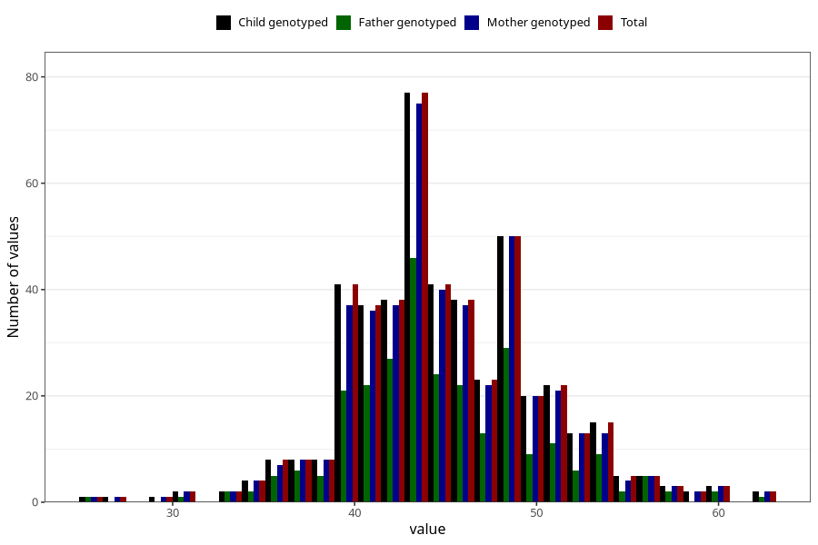

# muscle_mass_kg_wf
Variable mapping to `WK18` in `WF_Klinikkskjema_v12`.
- Number of values:

| Value | Total | Child genotyped | Mother genotyped | Father genotyped |
| ----- | ----- | --------------- | ---------------- | ---------------- |
| Missing | 80535 | 80535 | 76163 | 53331 |
| Non-missing | 470 | 470 | 454 | 273 |
| 25th percentile | 42 | 42 | 42 | 42 |
| 50th percentile | 45 | 45 | 45 | 44 |
| 75th percentile | 48 | 48 | 48 | 48 |
| Mean | 45.036170212766 | 45.036170212766 | 45.0462555066079 | 44.8644688644689 |
| Standard deviation | 5.21568593358019 | 5.21568593358019 | 5.20443617750686 | 5.15209314544661 |
| N | 470 | 470 | 454 | 273 |

