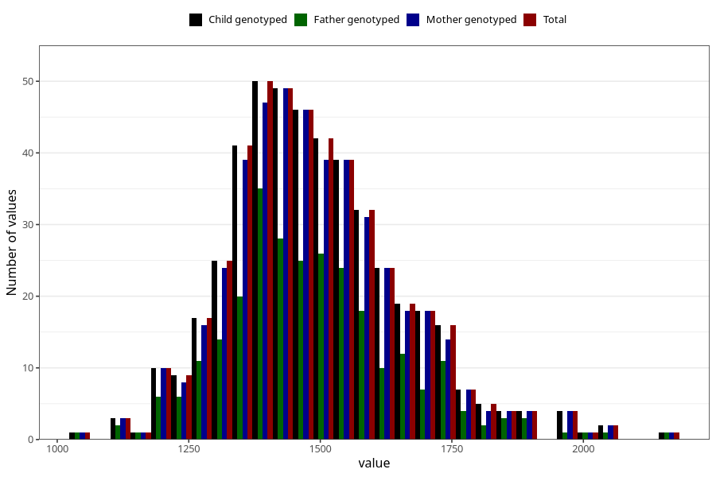

# resting_metab_wf
Variable mapping to `WK20` in `WF_Klinikkskjema_v12`.
- Number of values:

| Value | Total | Child genotyped | Mother genotyped | Father genotyped |
| ----- | ----- | --------------- | ---------------- | ---------------- |
| Missing | 80535 | 80535 | 76163 | 53331 |
| Non-missing | 470 | 470 | 454 | 273 |
| 25th percentile | 1380.25 | 1380.25 | 1381.75 | 1384 |
| 50th percentile | 1472.5 | 1472.5 | 1472.5 | 1466 |
| 75th percentile | 1580.5 | 1580.5 | 1580.5 | 1573 |
| Mean | 1492.29361702128 | 1492.29361702128 | 1492.68281938326 | 1487.27838827839 |
| Standard deviation | 165.327854678912 | 165.327854678912 | 165.074699299337 | 167.205566973126 |
| N | 470 | 470 | 454 | 273 |

