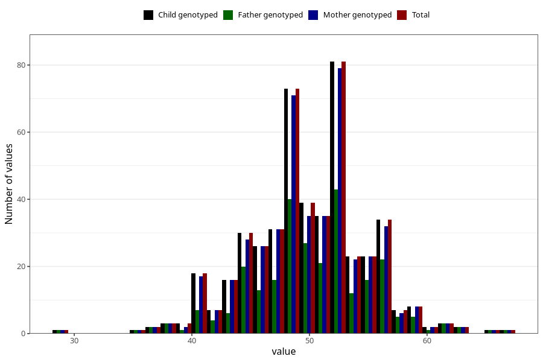

# water_pct_wf
Variable mapping to `WK17` in `WF_Klinikkskjema_v12`.
- Number of values:

| Value | Total | Child genotyped | Mother genotyped | Father genotyped |
| ----- | ----- | --------------- | ---------------- | ---------------- |
| Missing | 80535 | 80535 | 76163 | 53331 |
| Non-missing | 470 | 470 | 454 | 273 |
| 25th percentile | 47 | 47 | 47 | 47 |
| 50th percentile | 50 | 50 | 50 | 50 |
| 75th percentile | 53 | 53 | 53 | 53 |
| Mean | 49.9404255319149 | 49.9404255319149 | 49.942731277533 | 50.2490842490842 |
| Standard deviation | 5.03343446417093 | 5.03343446417093 | 5.0241164562577 | 5.31544028358114 |
| N | 470 | 470 | 454 | 273 |

