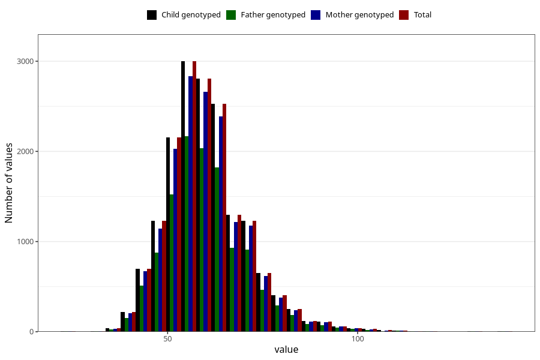

# weight_14c
Variable mapping to `UB221` in `Ungdomsskjema_Barn_v12_standard`.
- Number of values:

| Value | Total | Child genotyped | Mother genotyped | Father genotyped |
| ----- | ----- | --------------- | ---------------- | ---------------- |
| Missing | 64061 | 64061 | 60609 | 41396 |
| Non-missing | 16944 | 16944 | 16008 | 12208 |
| 25th percentile | 53 | 53 | 53 | 53 |
| 50th percentile | 59 | 59 | 59 | 59 |
| 75th percentile | 66 | 66 | 66 | 66 |
| Mean | 60.3581208687441 | 60.3581208687441 | 60.3628185907046 | 60.3598460026212 |
| Standard deviation | 10.9827788838417 | 10.9827788838417 | 10.9763250670515 | 10.9500388241648 |
| N | 16944 | 16944 | 16008 | 12208 |

