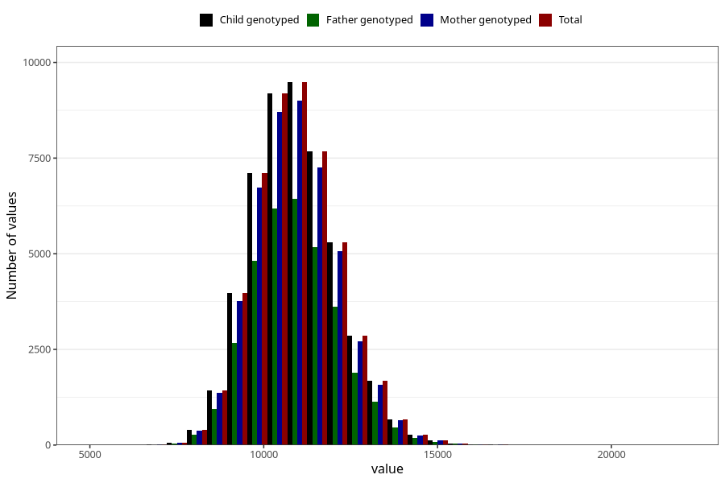

# weight_15_18m_1
Variable mapping to `EE398` in `Skjema5_18mnd_v12`.
- Number of values:

| Value | Total | Child genotyped | Mother genotyped | Father genotyped |
| ----- | ----- | --------------- | ---------------- | ---------------- |
| Missing | 30693 | 30693 | 28924 | 19643 |
| Non-missing | 50312 | 50312 | 47693 | 33961 |
| 25th percentile | 10060 | 10060 | 10060 | 10066 |
| 50th percentile | 10860 | 10860 | 10860 | 10865 |
| 75th percentile | 11700 | 11700 | 11700 | 11700 |
| Mean | 10925.110550167 | 10925.110550167 | 10924.3545384019 | 10926.5877624334 |
| Standard deviation | 1219.56299187025 | 1219.56299187025 | 1220.33254980972 | 1215.40340378909 |
| N | 50312 | 50312 | 47693 | 33961 |

