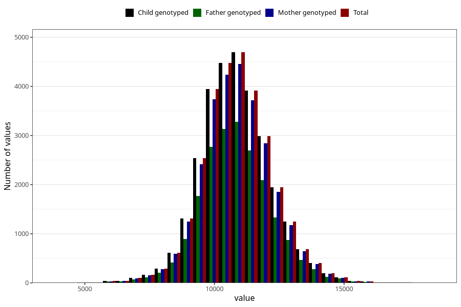

# weight_15_18m_2
Variable mapping to `GG16` in `Skjema6_3aar_v12`.
- Number of values:

| Value | Total | Child genotyped | Mother genotyped | Father genotyped |
| ----- | ----- | --------------- | ---------------- | ---------------- |
| Missing | 51188 | 51188 | 48329 | 32841 |
| Non-missing | 29817 | 29817 | 28288 | 20763 |
| 25th percentile | 10000 | 10000 | 10000 | 10000 |
| 50th percentile | 10800 | 10800 | 10800 | 10800 |
| 75th percentile | 11700 | 11700 | 11700 | 11700 |
| Mean | 10861.283563068 | 10861.283563068 | 10859.8088235294 | 10863.1585994317 |
| Standard deviation | 1362.79194442994 | 1362.79194442994 | 1360.33057909114 | 1362.36366494051 |
| N | 29817 | 29817 | 28288 | 20763 |

