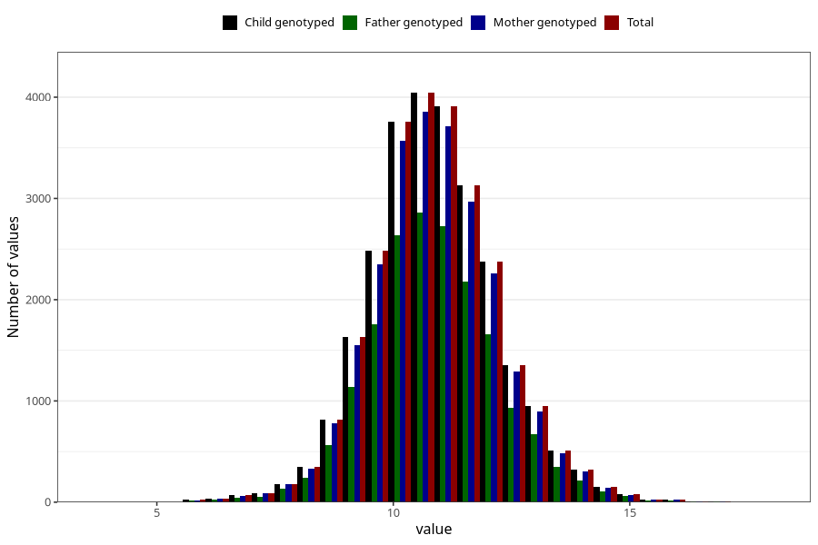

# weight_16m
Variable created during phenotype curation.
- Number of values:

| Value | Total | Child genotyped | Mother genotyped | Father genotyped |
| ----- | ----- | --------------- | ---------------- | ---------------- |
| Missing | 54641 | 54641 | 51590 | 35173 |
| Non-missing | 26364 | 26364 | 25027 | 18431 |
| 25th percentile | 10 | 10 | 10 | 10 |
| 50th percentile | 10.81 | 10.81 | 10.81 | 10.8 |
| 75th percentile | 11.7 | 11.7 | 11.7 | 11.7 |
| Mean | 10.870345774541 | 10.870345774541 | 10.8688558756543 | 10.8707612717704 |
| Standard deviation | 1.348146949903 | 1.348146949903 | 1.34596842784541 | 1.34674715483481 |
| N | 26364 | 26364 | 25027 | 18431 |

