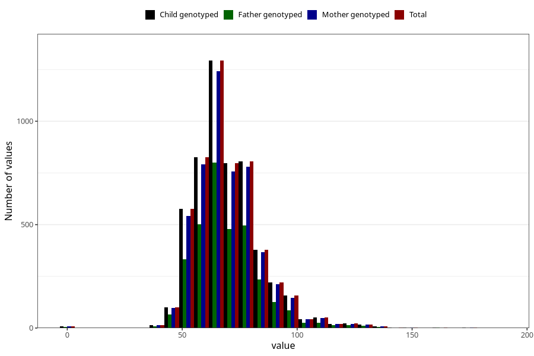

# weight_18
Variable mapping to `VE44` in `18-aarsskjema_v12_standard`.
- Number of values:

| Value | Total | Child genotyped | Mother genotyped | Father genotyped |
| ----- | ----- | --------------- | ---------------- | ---------------- |
| Missing | 75655 | 75655 | 71500 | 50365 |
| Non-missing | 5350 | 5350 | 5117 | 3239 |
| 25th percentile | 60 | 60 | 60 | 60 |
| 50th percentile | 68 | 68 | 68 | 68 |
| 75th percentile | 77 | 77 | 77 | 77 |
| Mean | 70.0943925233645 | 70.0943925233645 | 70.0916552667579 | 70.0083359061439 |
| Standard deviation | 15.0521082308758 | 15.0521082308758 | 14.9384848459196 | 14.8406272471171 |
| N | 5350 | 5350 | 5117 | 3239 |

