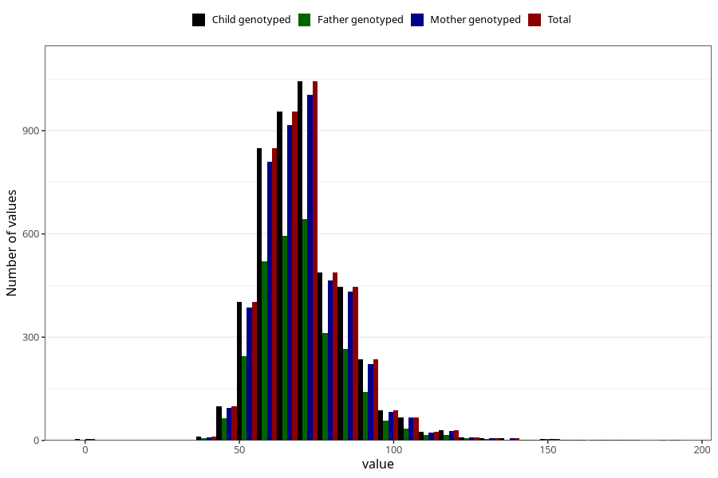

# weight_19
Variable mapping to `VG135` in `19_aarsskjema_standard`.
- Number of values:

| Value | Total | Child genotyped | Mother genotyped | Father genotyped |
| ----- | ----- | --------------- | ---------------- | ---------------- |
| Missing | 76221 | 76221 | 72038 | 50661 |
| Non-missing | 4784 | 4784 | 4579 | 2943 |
| 25th percentile | 61 | 61 | 61 | 61 |
| 50th percentile | 69 | 69 | 69 | 69 |
| 75th percentile | 79 | 79 | 79 | 78 |
| Mean | 71.0171404682274 | 71.0171404682274 | 70.9989080585281 | 70.9181107713218 |
| Standard deviation | 14.8258874977692 | 14.8258874977692 | 14.7951720318564 | 14.6026834265107 |
| N | 4784 | 4784 | 4579 | 2943 |

