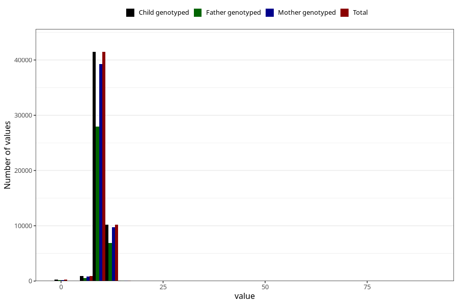

# weight_1y
Variable mapping to `EE392` in `Skjema5_18mnd_v12`.
- Number of values:

| Value | Total | Child genotyped | Mother genotyped | Father genotyped |
| ----- | ----- | --------------- | ---------------- | ---------------- |
| Missing | 28142 | 28142 | 26507 | 17991 |
| Non-missing | 52863 | 52863 | 50110 | 35613 |
| 25th percentile | 9.15 | 9.15 | 9.15 | 9.16 |
| 50th percentile | 9.88 | 9.88 | 9.88 | 9.885 |
| 75th percentile | 10.645 | 10.645 | 10.645 | 10.64 |
| Mean | 9.90519064373948 | 9.90519064373948 | 9.90520588704849 | 9.90903686855923 |
| Standard deviation | 1.3072096655163 | 1.3072096655163 | 1.30749982847039 | 1.32215360269662 |
| N | 52863 | 52863 | 50110 | 35613 |

