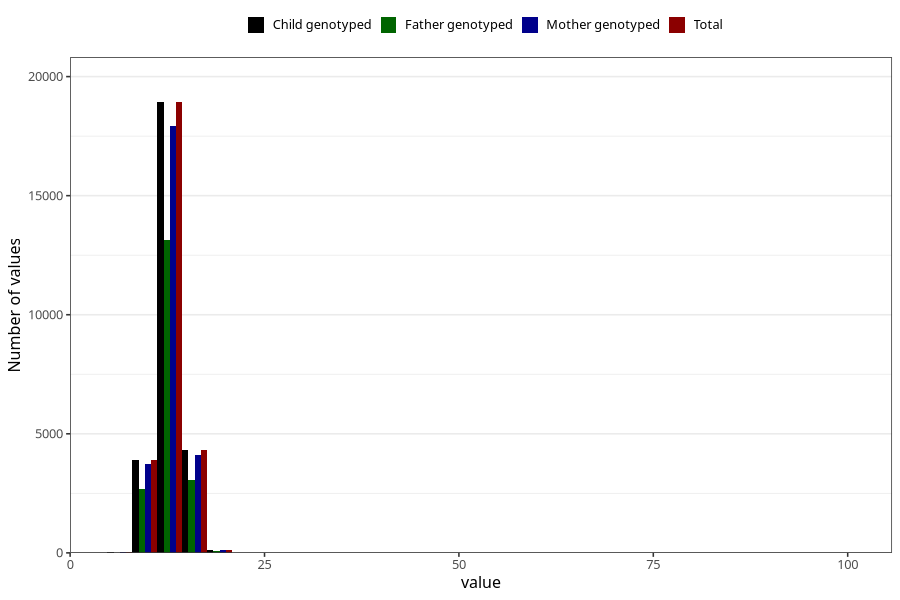

# weight_2y
Variable mapping to `GG21` in `Skjema6_3aar_v12`.
- Number of values:

| Value | Total | Child genotyped | Mother genotyped | Father genotyped |
| ----- | ----- | --------------- | ---------------- | ---------------- |
| Missing | 53671 | 53671 | 50695 | 34643 |
| Non-missing | 27334 | 27334 | 25922 | 18961 |
| 25th percentile | 11.9 | 11.9 | 11.9 | 11.91 |
| 50th percentile | 12.9 | 12.9 | 12.9 | 12.9 |
| 75th percentile | 14 | 14 | 14 | 14 |
| Mean | 12.9157810785103 | 12.9157810785103 | 12.9142508294113 | 12.9311476187965 |
| Standard deviation | 1.99228419530361 | 1.99228419530361 | 2.01321643045669 | 2.00888354895981 |
| N | 27334 | 27334 | 25922 | 18961 |

