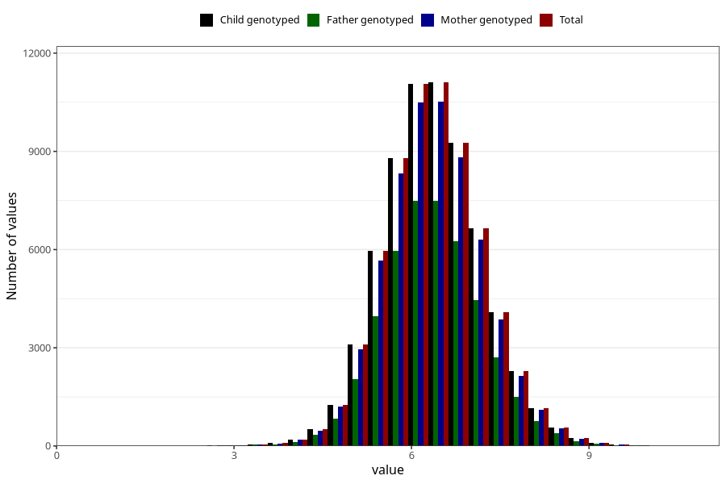

# weight_3m
Variable mapping to `DD218` in `Skjema4_6mnd_v12`.
- Number of values:

| Value | Total | Child genotyped | Mother genotyped | Father genotyped |
| ----- | ----- | --------------- | ---------------- | ---------------- |
| Missing | 14440 | 14440 | 13533 | 8931 |
| Non-missing | 66565 | 66565 | 63084 | 44673 |
| 25th percentile | 5.82 | 5.82 | 5.82 | 5.83 |
| 50th percentile | 6.35 | 6.35 | 6.35 | 6.35 |
| 75th percentile | 6.9 | 6.9 | 6.9 | 6.9 |
| Mean | 6.37671771952227 | 6.37671771952227 | 6.37575296430157 | 6.37583197904775 |
| Standard deviation | 0.830867720036272 | 0.830867720036272 | 0.829959217100221 | 0.825091283328433 |
| N | 66565 | 66565 | 63084 | 44673 |

