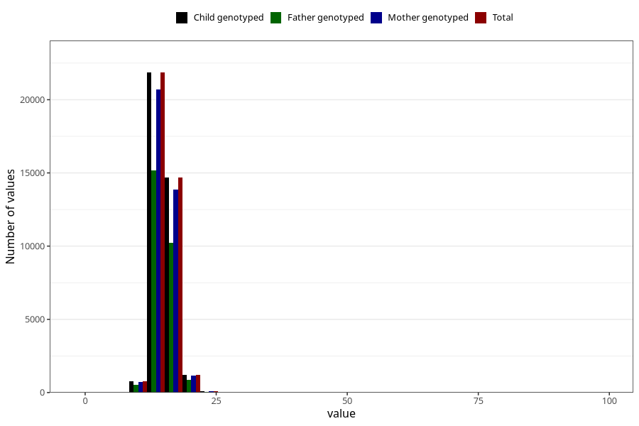

# weight_3y
Variable mapping to `GG26` in `Skjema6_3aar_v12`.
- Number of values:

| Value | Total | Child genotyped | Mother genotyped | Father genotyped |
| ----- | ----- | --------------- | ---------------- | ---------------- |
| Missing | 42369 | 42369 | 40095 | 26714 |
| Non-missing | 38636 | 38636 | 36522 | 26890 |
| 25th percentile | 14 | 14 | 14 | 14 |
| 50th percentile | 15 | 15 | 15 | 15 |
| 75th percentile | 16 | 16 | 16 | 16 |
| Mean | 15.0618430996998 | 15.0618430996998 | 15.0602442363507 | 15.0701413164745 |
| Standard deviation | 1.89495305972473 | 1.89495305972473 | 1.89756916366857 | 1.85520865722713 |
| N | 38636 | 38636 | 36522 | 26890 |

