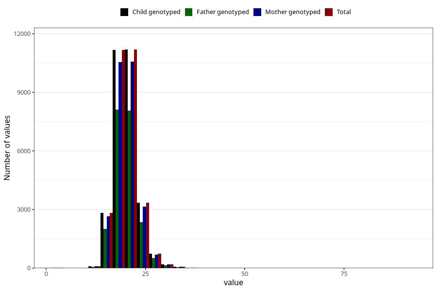

# weight_5y
Variable mapping to `LL13` in `Skjema5aar_v12`.
- Number of values:

| Value | Total | Child genotyped | Mother genotyped | Father genotyped |
| ----- | ----- | --------------- | ---------------- | ---------------- |
| Missing | 51328 | 51328 | 48583 | 32255 |
| Non-missing | 29677 | 29677 | 28034 | 21349 |
| 25th percentile | 18 | 18 | 18 | 18 |
| 50th percentile | 20 | 20 | 20 | 20 |
| 75th percentile | 21.5 | 21.5 | 21.5 | 21.5 |
| Mean | 20.0194056002965 | 20.0194056002965 | 20.0236034814868 | 20.0023279778912 |
| Standard deviation | 3.07972071532761 | 3.07972071532761 | 3.09261545952465 | 3.04942081677128 |
| N | 29677 | 29677 | 28034 | 21349 |

