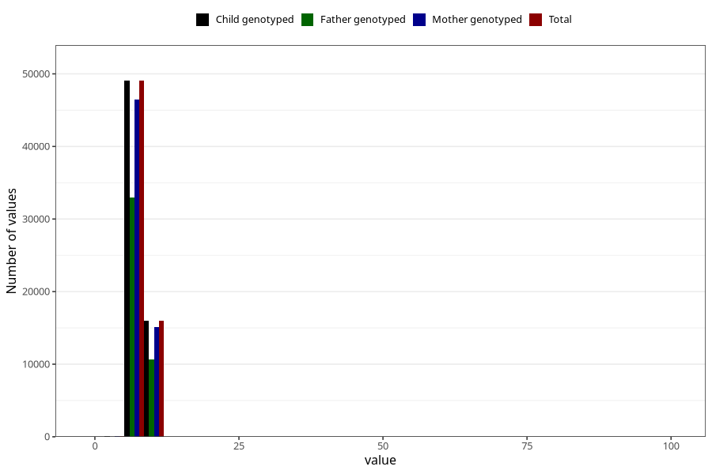

# weight_6m
Variable mapping to `DD224` in `Skjema4_6mnd_v12`.
- Number of values:

| Value | Total | Child genotyped | Mother genotyped | Father genotyped |
| ----- | ----- | --------------- | ---------------- | ---------------- |
| Missing | 15908 | 15908 | 14931 | 9911 |
| Non-missing | 65097 | 65097 | 61686 | 43693 |
| 25th percentile | 7.27 | 7.27 | 7.27 | 7.26 |
| 50th percentile | 7.885 | 7.885 | 7.885 | 7.88 |
| 75th percentile | 8.53 | 8.53 | 8.53 | 8.525 |
| Mean | 7.93783799560656 | 7.93783799560656 | 7.93722246538923 | 7.93409360767171 |
| Standard deviation | 1.17289001728608 | 1.17289001728608 | 1.1830293586607 | 1.14593439145685 |
| N | 65097 | 65097 | 61686 | 43693 |

