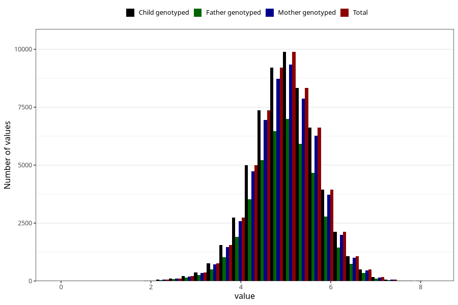

# weight_6w
Variable mapping to `DD212` in `Skjema4_6mnd_v12`.
- Number of values:

| Value | Total | Child genotyped | Mother genotyped | Father genotyped |
| ----- | ----- | --------------- | ---------------- | ---------------- |
| Missing | 20874 | 20874 | 19776 | 11301 |
| Non-missing | 60131 | 60131 | 56841 | 42303 |
| 25th percentile | 4.545 | 4.545 | 4.545 | 4.55 |
| 50th percentile | 5.01 | 5.01 | 5.005 | 5.01 |
| 75th percentile | 5.4735 | 5.4735 | 5.47 | 5.47 |
| Mean | 4.99936565166054 | 4.99936565166054 | 4.99862370472018 | 5.00072538590644 |
| Standard deviation | 0.728829356404485 | 0.728829356404485 | 0.728267848377194 | 0.723613037125305 |
| N | 60131 | 60131 | 56841 | 42303 |

