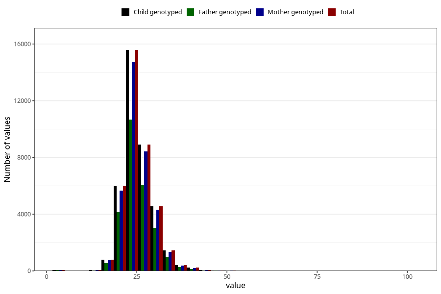

# weight_7y
Variable mapping to `JJ325` in `Skjema7aar_v12`.
- Number of values:

| Value | Total | Child genotyped | Mother genotyped | Father genotyped |
| ----- | ----- | --------------- | ---------------- | ---------------- |
| Missing | 42907 | 42907 | 40538 | 27618 |
| Non-missing | 38098 | 38098 | 36079 | 25986 |
| 25th percentile | 22.4 | 22.4 | 22.4 | 22.3 |
| 50th percentile | 25 | 25 | 25 | 24.9 |
| 75th percentile | 27.5 | 27.5 | 27.5 | 27.3 |
| Mean | 25.1990786917948 | 25.1990786917948 | 25.198018237756 | 25.1383360270915 |
| Standard deviation | 4.30770172307994 | 4.30770172307994 | 4.2958218385009 | 4.22987455365407 |
| N | 38098 | 38098 | 36079 | 25986 |

