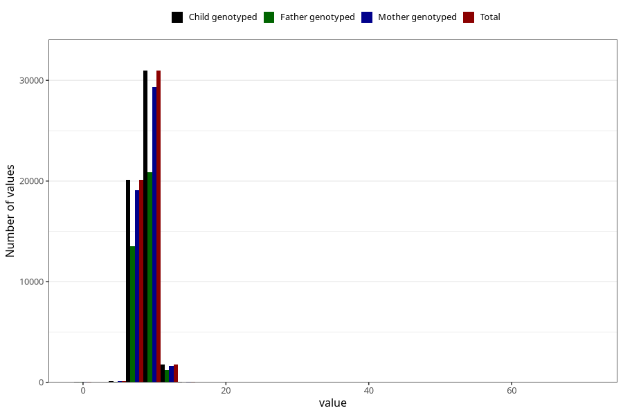

# weight_8m
Variable mapping to `EE386` in `Skjema5_18mnd_v12`.
- Number of values:

| Value | Total | Child genotyped | Mother genotyped | Father genotyped |
| ----- | ----- | --------------- | ---------------- | ---------------- |
| Missing | 27939 | 27939 | 26302 | 17857 |
| Non-missing | 53066 | 53066 | 50315 | 35747 |
| 25th percentile | 8.075 | 8.075 | 8.0725 | 8.08 |
| 50th percentile | 8.75 | 8.75 | 8.745 | 8.75 |
| 75th percentile | 9.46 | 9.46 | 9.46 | 9.46 |
| Mean | 8.7915141710323 | 8.7915141710323 | 8.79095236013117 | 8.79544070831119 |
| Standard deviation | 1.13304561908753 | 1.13304561908753 | 1.13436093477762 | 1.14447474445483 |
| N | 53066 | 53066 | 50315 | 35747 |

