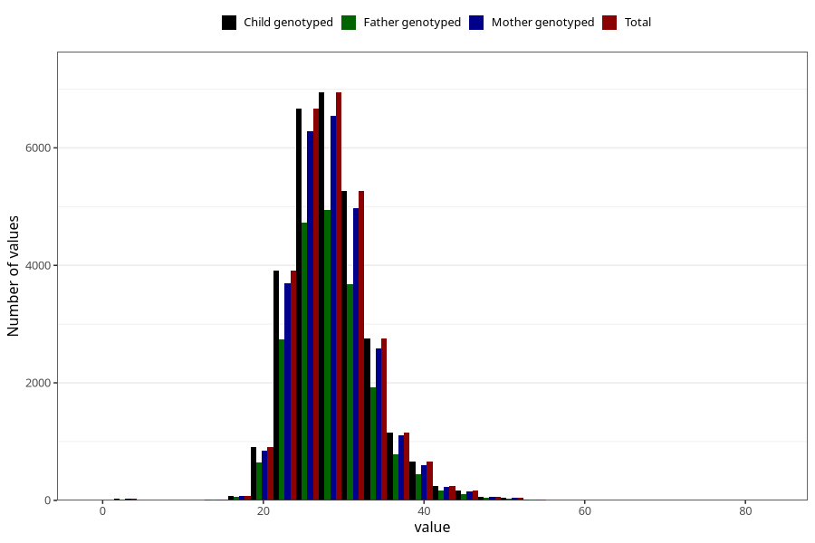

# weight_8y
Variable mapping to `NN25` in `Skjema8aar_v12`.
- Number of values:

| Value | Total | Child genotyped | Mother genotyped | Father genotyped |
| ----- | ----- | --------------- | ---------------- | ---------------- |
| Missing | 52115 | 52115 | 49352 | 33267 |
| Non-missing | 28890 | 28890 | 27265 | 20337 |
| 25th percentile | 25 | 25 | 25 | 25 |
| 50th percentile | 28 | 28 | 28 | 28 |
| 75th percentile | 31 | 31 | 31 | 31 |
| Mean | 28.489141571478 | 28.489141571478 | 28.490636346965 | 28.4544573929291 |
| Standard deviation | 4.97396720360078 | 4.97396720360078 | 4.98021636053862 | 4.9456903850725 |
| N | 28890 | 28890 | 27265 | 20337 |

