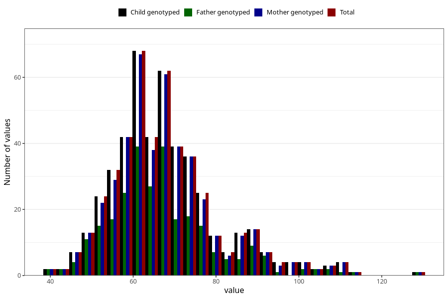

# weight_wf
Variable mapping to `WK15` in `WF_Klinikkskjema_v12`.
- Number of values:

| Value | Total | Child genotyped | Mother genotyped | Father genotyped |
| ----- | ----- | --------------- | ---------------- | ---------------- |
| Missing | 80535 | 80535 | 76163 | 53331 |
| Non-missing | 470 | 470 | 454 | 273 |
| 25th percentile | 59 | 59 | 59 | 59 |
| 50th percentile | 66 | 66 | 66 | 65 |
| 75th percentile | 74 | 74 | 74 | 73 |
| Mean | 67.863829787234 | 67.863829787234 | 67.8964757709251 | 67.1721611721612 |
| Standard deviation | 13.3046383295341 | 13.3046383295341 | 13.317993468417 | 13.4813199226293 |
| N | 470 | 470 | 454 | 273 |

