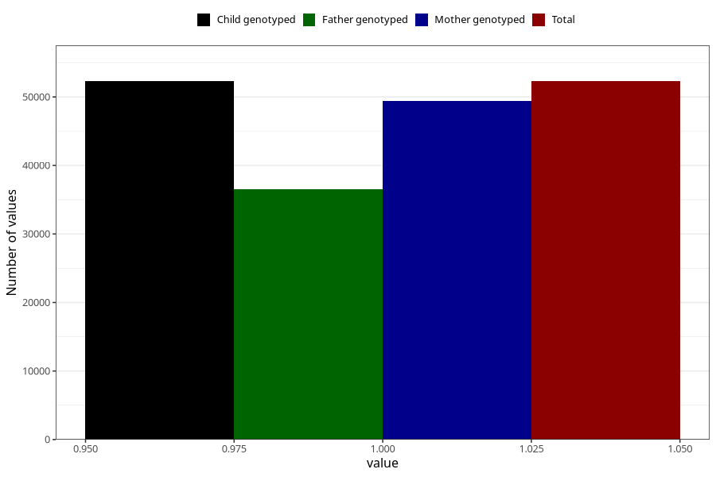

# abnormal_head_circumference_no_18m
Variable mapping to `EE811` in `Skjema5_18mnd_v12`.
- Number of values:

| Value | Total | Child genotyped | Mother genotyped | Father genotyped |
| ----- | ----- | --------------- | ---------------- | ---------------- |
| Missing | 28715 | 28715 | 27166 | 17125 |
| Non-missing | 52290 | 52290 | 49451 | 36479 |
| 1 | 52290 | 52290 | 49451 | 36479 |

