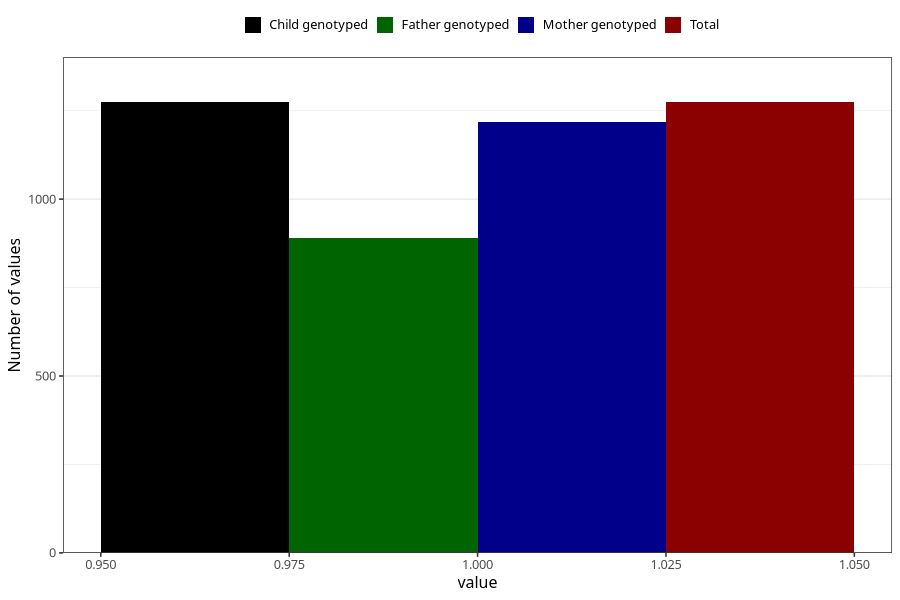

# abnormal_head_circumference_previously_18m
Variable mapping to `EE813` in `Skjema5_18mnd_v12`.
- Number of values:

| Value | Total | Child genotyped | Mother genotyped | Father genotyped |
| ----- | ----- | --------------- | ---------------- | ---------------- |
| Missing | 79731 | 79731 | 75400 | 52714 |
| Non-missing | 1274 | 1274 | 1217 | 890 |
| 1 | 1274 | 1274 | 1217 | 890 |

