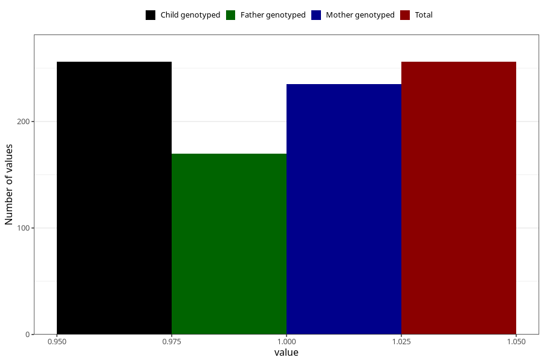

# abnormal_head_circumference_yes_18m
Variable mapping to `EE812` in `Skjema5_18mnd_v12`.
- Number of values:

| Value | Total | Child genotyped | Mother genotyped | Father genotyped |
| ----- | ----- | --------------- | ---------------- | ---------------- |
| Missing | 80749 | 80749 | 76382 | 53434 |
| Non-missing | 256 | 256 | 235 | 170 |
| 1 | 256 | 256 | 235 | 170 |

