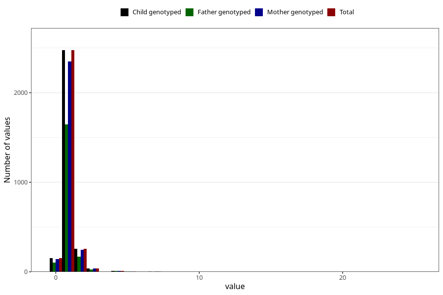

# accident_injury_number_12_18m
Variable mapping to `EE268` in `Skjema5_18mnd_v12`.
- Number of values:

| Value | Total | Child genotyped | Mother genotyped | Father genotyped |
| ----- | ----- | --------------- | ---------------- | ---------------- |
| Missing | 78050 | 78050 | 73810 | 51639 |
| Non-missing | 2955 | 2955 | 2807 | 1965 |
| 0 | 153 | 153 | 143 | 105 |
| 1 | 2474 | 2474 | 2350 | 1644 |
| 2 | 260 | 260 | 246 | 170 |
| 3 | 39 | 39 | 39 | 26 |
| 4 | 10 | 10 | 10 | 8 |
| 5 | 6 | 6 | 6 | 4 |
| 6 | 2 | 2 | 2 | 0 |
| 7 | 3 | 3 | 3 | 2 |
| 8 | 1 | 1 | 1 | 0 |
| 14 | 1 | 1 | 1 | 1 |
| 15 | 1 | 1 | 1 | 1 |
| 16 | 2 | 2 | 2 | 1 |
| 17 | 1 | 1 | 1 | 1 |
| 20 | 1 | 1 | 1 | 1 |
| 25 | 1 | 1 | 1 | 1 |

